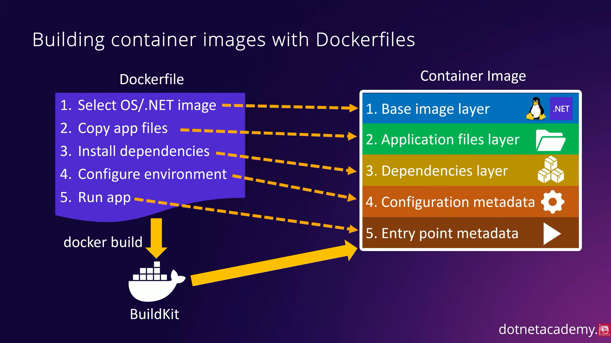

## Dockerfile
เป็นไฟล์ที่ระบุคำสั่งทั้งหมดที่จำเป็นต้องใช้ใน docker image เช่น
1. Select OS/.NET image
2. Copy app file
3. Install dependencies
4. Configure environment
5. Run app

โดยเมื่อเรากำหนดคำสั่งที่จำเป็นในการสร้าง image ทั้งหมดครบแล้ว เราสามารถใช้คำสั่ง **docker build** เพื่อนำคำสั่งที่เราระบุไปสร้างเป็น docker image

